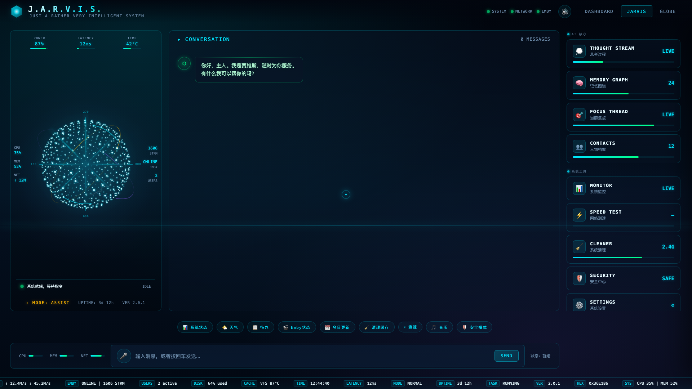
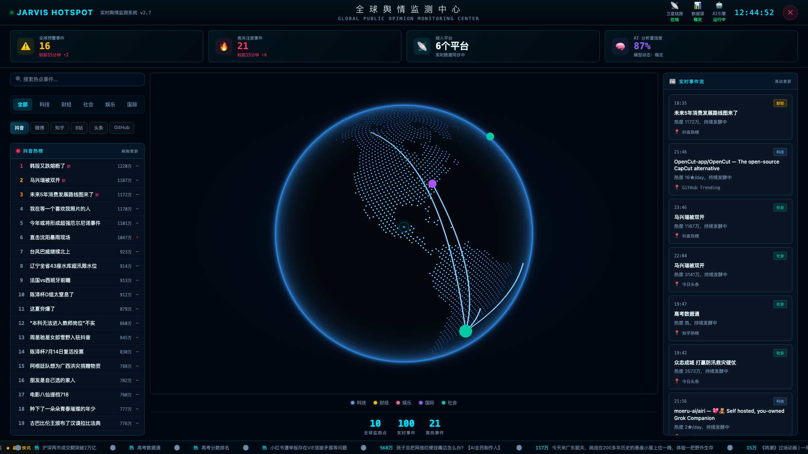
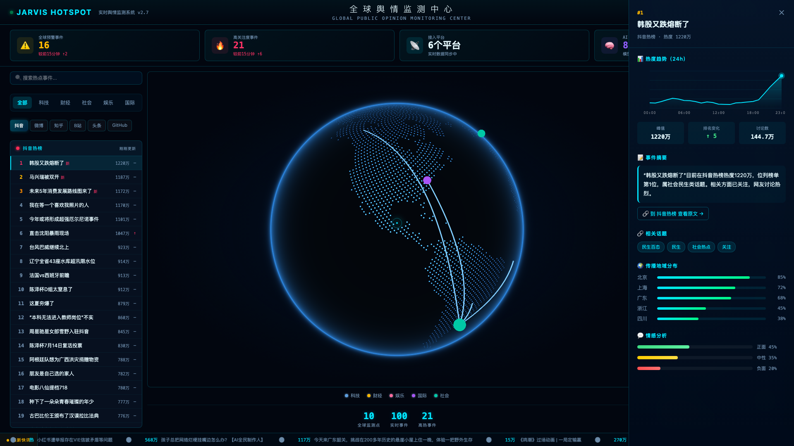
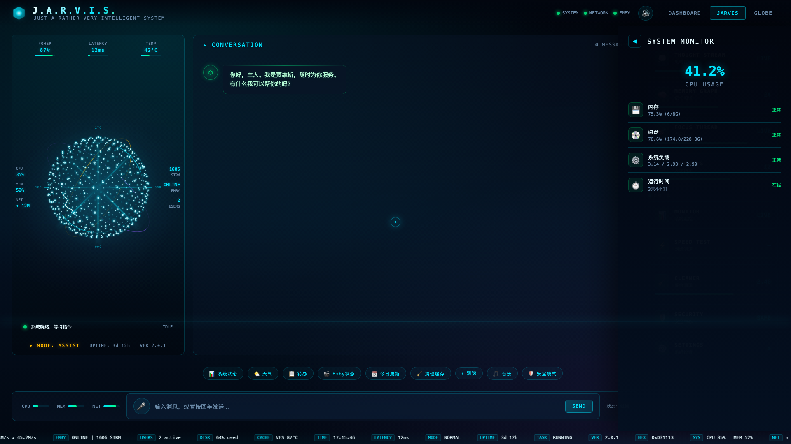

# 🤖 JARVIS AI · 舆情监控大屏

> 一个科幻风格的 AI 助手交互界面 + 实时舆情监控可视化大屏，基于纯前端 + 轻量 Python 后端，零第三方依赖，开箱即用。



## ✨ 项目简介

**JARVIS AI · 舆情监控大屏** 是一套融合了 AI 对话助手与实时热点舆情监控的可视化系统，灵感来自《钢铁侠》中的贾维斯。它包含两大核心模块：

- **🎙️ JARVIS AI 助手**：科幻全息风格的交互界面，支持对话、思考流可视化、记忆图谱、系统监控等 12 个功能面板。
- **🌍 舆情监控大屏**：聚合微博、抖音、知乎、B站、今日头条、GitHub 六大平台实时热榜，配合 3D 地球热点地理打点，实时事件流、热度趋势分析、智能标签提取。

所有数据均为**真实数据**：热榜来自各平台公开接口，附带真实来源链接；地球打点根据热点标题自动提取地理位置并聚合热度。

## 🎬 预览效果

### JARVIS AI 助手首页
科幻全息 UI，粒子球体、能量环、12 个功能卡片。


### 舆情监控大屏
六平台实时热榜 + 3D 地球热点打点 + 实时事件流。



### 热点详情面板
热度趋势图、智能标签、真实来源链接、传播地域分布、情感分析。



### 真实系统监控
CPU / 内存 / 磁盘 / 系统负载 / 运行时间，全部真实数据，定时刷新。



## 🚀 核心功能

### JARVIS AI 助手
- 🎨 **科幻全息 UI**：粒子球体动画、数据能量环、扫描线特效
- 💬 **AI 对话**：接入 OpenAI 兼容 API，流式输出，支持动态卡片渲染
- 🧠 **思考流可视化**：实时展示 AI 检索、思考、生成过程
- 📊 **真实系统监控**：CPU / 内存 / 磁盘 / 系统负载 / 运行时间（macOS 原生命令，零依赖）
- 🧹 **磁盘清理扫描**：真实扫描缓存 / 日志 / 回收站 / 临时文件大小
- 🎬 **Emby 媒体库**：真实电影 / 剧集 / 集数 / 在播会话统计（需配置 Emby）
- 🌐 **网络测速**：真实 ping / 下载 / 上传测速
- 🧬 **记忆图谱**：解析 Agent 记忆文件生成可交互的 3D 记忆节点网络

### 舆情监控大屏
- 📡 **六平台实时热榜**：微博 / 抖音 / 知乎 / B站 / 今日头条 / GitHub Trending
- 🌍 **3D 地球热点打点**：基于 [cobe](https://github.com/shuding/cobe) 的 WebGL 地球，热点标题自动提取地理位置，按热度聚合打点，离线可用
- 📰 **实时事件流**：多平台热点滚动播报，标注来源地域
- 📈 **热度趋势分析**：确定性热度曲线、排名变化、讨论量估算
- 🏷️ **智能标签提取**：从热点标题自动提取关键词标签
- 🔗 **真实来源链接**：每条热点可一键跳转原平台查看原文
- 🔍 **分类筛选 + 搜索**：科技 / 财经 / 娱乐 / 国际 / 社会五大分类

## 📦 技术栈

- **前端**：原生 HTML / CSS / JavaScript（无框架），Canvas + WebGL
- **后端**：Python 3 标准库（`http.server`），**零第三方依赖**
- **3D 地球**：cobe（本地加载，离线可用）
- **数据源**：各平台公开热榜接口

## 🛠️ 安装教程

### 环境要求
- Python 3.7+
- 现代浏览器（Chrome / Edge / Safari）

### 1. 克隆项目

```bash
git clone https://github.com/ZHANGFA88/jarvis-ai-monitor.git
cd jarvis-ai-monitor
```

### 2. 配置环境变量（可选）

复制环境变量模板：

```bash
cp .env.example .env
```

编辑 `.env`，按需填写配置：

```bash
# Web 服务端口
DASHBOARD_PORT=8765

# （可选）AI 对话功能：OpenAI 兼容 API
# 舆情监控不需要配置此项也能正常运行
OPENCLAW_API_URL=http://127.0.0.1:18789/v1/chat/completions
OPENCLAW_API_TOKEN=你的_API_TOKEN
```

> 💡 **只用舆情监控大屏**：无需任何配置，直接启动即可。
> 💡 **需要 AI 对话**：填写 `OPENCLAW_API_TOKEN`（支持任何 OpenAI 兼容接口）。

### 3. 启动服务

```bash
# 方式一：启动脚本
bash scripts/start.sh

# 方式二：直接运行
python3 scripts/serve.py
```

### 4. 访问

浏览器打开：

```
http://127.0.0.1:8765/public/jarvis.html
```

- 点击首页 **HOT SPOT** 卡片进入舆情监控大屏
- 或直接访问：`http://127.0.0.1:8765/public/jarvis.html?hotspot=1`

## 🐳 Docker 部署（可选）

```bash
docker compose up -d
```

访问 `http://127.0.0.1:8765/public/jarvis.html`

## 🔐 安全说明

- **API Token 仅后端持有**：AI 对话通过后端 `/api/chat` 代理转发，Token 从环境变量读取，**永不暴露到前端**
- **敏感配置隔离**：`.env` 和 `config.json` 已在 `.gitignore` 中，不会提交
- **只读数据采集**：舆情数据仅读取平台公开接口，不做任何写入操作

## 📁 项目结构

```
jarvis-ai-monitor/
├── public/
│   ├── jarvis.html      # 主界面（AI 助手 + 舆情大屏）
│   └── cobe.js          # 3D 地球库（本地）
├── scripts/
│   ├── serve.py         # Python 后端（API + 静态服务）
│   └── start.sh         # 启动脚本
├── docs/
│   └── screenshots/     # 预览截图
├── .env.example         # 环境变量模板
├── config.example.json  # 配置模板
├── Dockerfile
└── docker-compose.yml
```

## 🔌 API 接口

| 接口 | 说明 |
|------|------|
| `GET /api/hotspot/all` | 获取全部平台热榜聚合数据 |
| `GET /api/hotspot/{platform}` | 获取指定平台热榜（weibo/douyin/zhihu/bilibili/toutiao/github） |
| `POST /api/chat` | AI 对话代理（流式，Token 后端注入） |
| `GET /api/system/stats` | 真实系统监控（CPU/内存/磁盘/负载/运行时间） |
| `GET /api/system/cleanup` | 磁盘可清理项扫描（只读不删） |
| `GET /api/system/speedtest` | 网络测速（ping/下载/上传） |
| `GET /api/agent/memory` | 解析 Agent 记忆文件为记忆节点 |
| `GET /api/emby/stats` | Emby 媒体库统计（需配置） |

## 📝 数据源说明

热榜数据来自各平台公开接口，2 分钟缓存。本项目仅用于学习和个人使用，请遵守各平台的使用条款。

## 📄 License

MIT

---

⭐ 如果这个项目对你有帮助，欢迎 Star！
